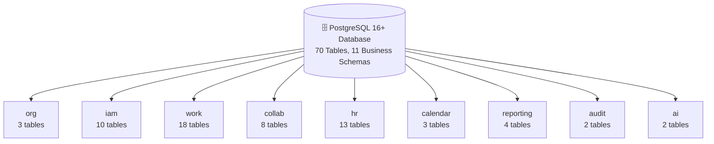

<div align="center">


[](https://vitejs.dev/)
[](https://reactjs.org/)
[](https://www.typescriptlang.org/)
[](https://tailwindcss.com/)
[](https://www.postgresql.org/)
[](LICENSE)


<p align="center">
  <a href="#-about-worksync"><b>🌟 About</b></a> •
  <a href="#-team-and-module-assignments"><b>👥 Team Modules</b></a> •
  <a href="#-all-10-interns-module-showcase"><b>🏆 Module Showcase</b></a> •
  <a href="#️-database-architecture"><b>🗄️ Database</b></a> •
  <a href="#-role-access-matrix"><b>🔐 Role Access</b></a> •
  <a href="#-tech-stack"><b>💻 Tech Stack</b></a> •
  <a href="#-getting-started"><b>⚡ Getting Started</b></a>
</p>

</div>

<div align="center">

</div>

---

## 🌟 About WorkSync

**WorkSync** is a Cyberpunk Glassmorphism Enterprise Office Management System built for modern software engineering teams. It delivers real time task orchestration, granular role based access control (RBAC), attendance tracking, AI powered prompt generation, Kanban boards, project calendars, and complete audit trail logging. 🧩

> 🚀 Built by a team of **10 active interns**, each owning a dedicated module, following a **70 table PostgreSQL 3NF schema** and a functional specification that covers permanent and temporary access roles, approval workflows, and full notification routing.

---

## 👥 Team and Module Assignments

<div align="center">

| No. | 🧑‍💻 Intern | 🎯 Assigned Module | 📊 Status |
|:---:|---|---|:---:|
| 01 | [@Salman-ahmed-2](https://github.com/Salman-ahmed-2) | Dashboard, Login, Frontend | 🟡 In Progress |
| 02 | [@TahaSohail-Goat](https://github.com/TahaSohail-Goat) | Dashboard, Frontend | 🟡 In Progress |
| 03 | [@laibainqilab-ds](https://github.com/laibainqilab-ds) | Project Management, Calendar | 🟡 In Progress |
| 04 | [@abihajibbran1-lang](https://github.com/abihajibbran1-lang) | Task Creation, Comments | 🟡 In Progress |
| 05 | [@Bilalmughal-07](https://github.com/Bilalmughal-07) | Kanban Board, Notifications | 🟡 In Progress |
| 06 | [@meowryam](https://github.com/meowryam) | Reports | 🟡 In Progress |
| 07 | [@AbdulAzeemHashmi](https://github.com/AbdulAzeemHashmi) | Team Members, Profile, Settings | 🟢 Completed |
| 08 | [@hassaanahmed-dev](https://github.com/hassaanahmed-dev) | Prompt Builder | 🟡 In Progress |
| 09 | [@inshrahmumtaz](https://github.com/inshrahmumtaz) | Attendance and Breaks | 🟡 In Progress |
| 10 | [@muhammad-haris2](https://github.com/muhammad-haris2) | Activity Log | 🟡 In Progress |

</div>

---

## 🏆 All 10 Interns Module Showcase

<details open>
<summary><b>1️⃣ 🖥️ Dashboard, Login, Frontend</b></summary>
<br/>

**Assigned to**: [`@Salman-ahmed-2`](https://github.com/Salman-ahmed-2) and [`@TahaSohail-Goat`](https://github.com/TahaSohail-Goat)

- 🏠 Central workspace dashboard with project, task, and attendance overview cards
- 🔐 Role selector login screen for Admin, Team Lead, HR, and Team Member access
- 🎨 Glassmorphism dark mode UI with cyan and purple gradient design system
- 📱 Responsive sidebar with collapsible navigation and keyboard shortcuts

</details>

<details open>
<summary><b>2️⃣ 📅 Project Management and Calendar</b></summary>
<br/>

**Assigned to**: [`@laibainqilab-ds`](https://github.com/laibainqilab-ds)

- 📁 Full project CRUD operations with approval workflows
- 🗓️ Calendar view showing deadlines, milestones, meetings, and leave events
- 📊 Progress tracking with milestone completion and task status distribution
- 🔒 Admin activation requirement configuration per project

</details>

<details open>
<summary><b>3️⃣ ✅ Task Creation and Comments</b></summary>
<br/>

**Assigned to**: [`@abihajibbran1-lang`](https://github.com/abihajibbran1-lang)

- 📝 Protected task creation with approval routing through Team Lead
- 💬 Asynchronous discussion threads on tasks with @mentions
- 🚧 Blocker reporting with mandatory explanation requirement
- 🔄 Status workflow, moving through Todo, In Progress, Review, Done, and Blocked
- 📎 File attachment upload for tasks and completion evidence

</details>

<details open>
<summary><b>4️⃣ 📋 Kanban Board and Notifications</b></summary>
<br/>

**Assigned to**: [`@Bilalmughal-07`](https://github.com/Bilalmughal-07)

- 🎯 Drag and drop Kanban board with column based task flow management
- 🔔 Real time notification inbox with read and unread state management
- 🏷️ Priority and status filters on the Kanban view
- 📲 Push notification routing matrix for all workspace events

</details>

<details open>
<summary><b>5️⃣ 📈 Reports</b></summary>
<br/>

**Assigned to**: [`@meowryam`](https://github.com/meowryam)

- 📊 Project progress, overdue tasks, workload distribution, and completion trends
- 💾 Saved report filters with scheduled generation support
- 📤 Report export in multiple formats
- 🔐 Role scoped report access, Admin sees all, Team Lead sees assigned projects, HR sees attendance

</details>

<details open>
<summary><b>6️⃣ 👥 Team Members, Personal Profile, Settings</b></summary>
<br/>

**Assigned to**: [`@AbdulAzeemHashmi`](https://github.com/AbdulAzeemHashmi) 🟢

**👥 Team Members**
- 📊 Member Hub with grid card and compact table dual view modes
- 🔍 Live search by Name, Email, GitHub handle, Department, and Title
- ✏️ Add, Edit, and Delete member modals with full form validation
- 🚨 Task Reassignment Safety Check blocks deletion when active tasks exist
- 💾 LocalStorage persistence for all user state across browser refreshes

**🧑 Personal Profile**
- 🎨 Role aware profile hero banner with status indicator and GitHub link
- ✏️ Edit Profile modal covering name, email, title, department, status, and GitHub handle
- 🔴 Admin panel, showing System Stats strip with Active Users, Open Tasks, and Active Projects
- 🟣 Team Lead panel, showing My Team tab with reporting members and task counts
- 🩷 HR panel, showing My HR Requests tab for submitted and reviewed HR requests

**⚙️ Settings**
- 🌙 Dark and Light mode theme toggle
- 🔔 Email, In App, and Weekly Digest notification preference toggles
- 🔒 Password update interface with inline validation feedback
- ⏰ Office hours configuration, Admin and HR can edit, Team Lead gets read only, Member has it hidden
- 🛡️ Admin Safeguards, including a masked AI API key, JSON Vault export, and Sole Admin protection check

</details>

<details open>
<summary><b>7️⃣ 🤖 Prompt Builder</b></summary>
<br/>

**Assigned to**: [`@hassaanahmed-dev`](https://github.com/hassaanahmed-dev)

- 💡 AI powered prompt generation for project and task context
- 📝 Editable generated output with version history tracking
- 🗃️ Saved prompts library organized by category
- 🔐 Prompt Builder scoped to data accessible by the current user role

</details>

<details open>
<summary><b>8️⃣ 🕐 Attendance and Breaks</b></summary>
<br/>

**Assigned to**: [`@inshrahmumtaz`](https://github.com/inshrahmumtaz)

- ✅ Daily check in and check out with working hours calculation
- ☕ Break timer with Lunch, Short Break, and Other break type categorization
- 📋 Leave request submission (Casual, Sick, Annual, Unpaid) with HR review routing
- 🩷 Attendance correction requests with HR approval workflow
- 🚫 HR self approval prevention with Administrator fallback routing

</details>

<details open>
<summary><b>9️⃣ 📋 Activity Log</b></summary>
<br/>

**Assigned to**: [`@muhammad-haris2`](https://github.com/muhammad-haris2)

- 📜 Append only activity log for all workspace operations
- 🔍 Filter by actor, action type, target entity, and date range
- 🏷️ Scope filtered views per role, Admin sees all activity, others see a scoped view
- 🔗 Action entries linked to target projects, tasks, attendance, and settings records

</details>

---

## 🗄️ Database Architecture

The system runs on **PostgreSQL 16+** normalized to **Third Normal Form (3NF)** with **70 tables** across **11 business schemas**. 🧠

<div align="center">



</div>

<details>
<summary><b>🔍 Click to Expand: All 11 Schemas</b></summary>

<div align="center">

| # | Schema | Tables | Responsibility |
|---|---|:---:|---|
| 1 | `org` | 3 | Organizations, Departments, Teams |
| 2 | `iam` | 10 | Users, Roles, Permissions, Scopes, History |
| 3 | `work` | 18 | Projects, Tasks, Blockers, Change Requests |
| 4 | `collab` | 8 | Files, Discussions, Comments, Mentions |
| 5 | `hr` | 13 | Attendance, Corrections, Leave, Schedules |
| 6 | `calendar` | 3 | Events, EventTypes, EventAttendees |
| 7 | `reporting` | 4 | Report Definitions, Runs, Exports |
| 8 | `ai` | 2 | Prompt Output Types and Generation History |
| 9 | `notify` | 4 | Notification Types, Preferences, Inbox |
| 10 | `config` | 3 | Organization and User Settings |
| 11 | `audit` | 2 | Append only Audit Events and Field Changes |

</div>

</details>

---

## 🔐 Role Access Matrix

<details open>
<summary><b>🔍 Click to Expand Role Permissions</b></summary>

<div align="center">

| Feature | 🔴 Admin | 🟣 Team Lead | 🩷 HR | 🔵 Team Member |
|---|:---:|:---:|:---:|:---:|
| Create, Edit, Delete Projects | ✅ | Assigned only | ❌ | ❌ |
| Create and Assign Tasks | ✅ | Assigned projects | ❌ | ❌ |
| Approve Protected Changes | ✅ Override | Assigned projects | ❌ | ❌ |
| View All Reports | ✅ | Assigned scope | Attendance only | Personal only |
| Manage All Attendance | ✅ | ❌ | Within HR scope | ❌ |
| Grant and Revoke Temp Roles | ✅ | ❌ | ❌ | ❌ |
| Edit Own Profile | ✅ | ✅ | ✅ | ✅ |
| View Team Members Tab | ✅ | ✅ | ✅ | ✅ |
| View Admin Quick Stats | ✅ | ❌ | ❌ | ❌ |
| View My Team Tab | ❌ | ✅ | ❌ | ❌ |
| View HR Requests Tab | ❌ | ❌ | ✅ | ❌ |
| Edit Office Hours | ✅ | Read only | ✅ | Hidden |
| Export System Backup | ✅ | ❌ | ❌ | ❌ |
| View Masked AI Key | ✅ | ❌ | ❌ | ❌ |
| Admin Safeguard Test | ✅ | ❌ | ❌ | ❌ |

</div>

</details>

---

## 💻 Tech Stack

<div align="center">

| Category | Technology |
|---|---|
| ⚛️ Framework | React 18 with TypeScript 5.5 |
| ⚡ Build Tool | Vite 6.4 |
| 🎨 Styling | Vanilla CSS, Tailwind CSS 3.4, and Custom Glassmorphism |
| 🧩 Icons | Lucide React |
| 🧠 State | React Context API with LocalStorage Persistence |
| 🗄️ Database | PostgreSQL 16+ (70 tables, 11 schemas, 163 FK relations) |

<br/>


&nbsp;

&nbsp;

&nbsp;

&nbsp;


</div>

---

## ⚡ Getting Started

### ✅ Prerequisites

- Node.js v18.0.0 or higher
- npm v9.0.0 or higher

<details open>
<summary><b>📦 Installation</b></summary>
<br/>

**1️⃣ Clone the repository:**

```bash
git clone https://github.com/Salman-ahmed-2/worksync.git
cd worksync
```

**2️⃣ Install dependencies:**

```bash
npm install
```

**3️⃣ Start the development server:**

```bash
npm run dev
```

**4️⃣ Open in browser:**

```
http://localhost:5173
```

</details>

### 🔨 Build Verification

```bash
npm run build
```

Expected output:

```text
vite v6.4.3 building for production...
transforming...
2088 modules transformed.
dist/index.html                   0.87 kB
dist/assets/index.css            73.73 kB
dist/assets/index.js            471.38 kB
built in 8.15s
```

---

## 📂 Specification Documents

<div align="center">

| Document | Format | Description |
|---|:---:|---|
| `Office_Management_System_Roles_Permissions_and_Workflows.docx` | 📄 DOCX | Roles, permissions, approval workflows, and notification routing functional spec |
| `OfficeManagementDB_PostgreSQL_Schema_and_ERD_Report.docx` | 📄 DOCX | 70 table PostgreSQL 3NF schema design and full ERD report |
| `docs/Office_Management_System_Roles_Permissions_and_Workflows_content.txt` | 📝 TXT | Plaintext extracted content for direct reading |
| `docs/OfficeManagementDB_PostgreSQL_Schema_and_ERD_Report_content.txt` | 📝 TXT | Plaintext schema dictionary, integrity rules, and deployment guidance |

</div>

---

<div align="center">

### ⭐ If WorkSync impressed you, consider giving it a star

Built with ❤️ by the **WorkSync Intern Team**

[](https://github.com/Salman-ahmed-2/worksync)


</div>